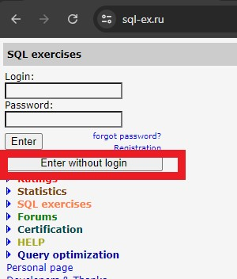
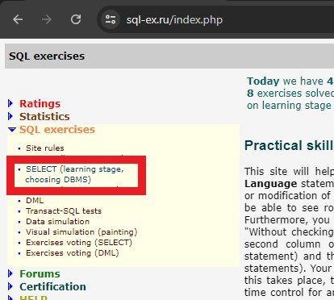
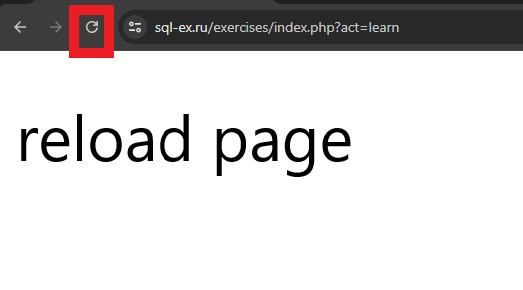
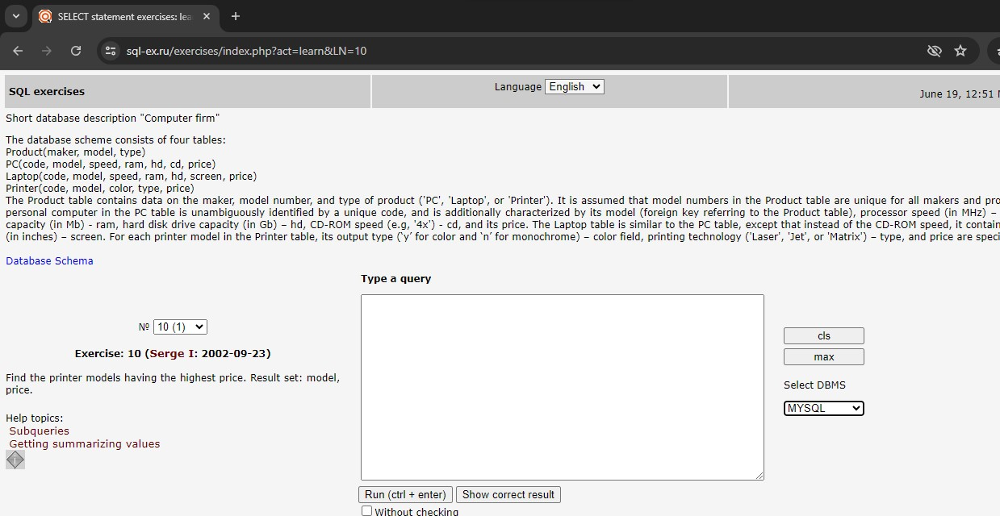

### Prerequisites

1. Use MYSQL version >= 8 for `with (<subquery) as` syntax.

### Getting started

Download the script files from [mysql_script](./mysql_script), and run them to create seed data.
The files are also available at [sql-ex.ru](https://sql-ex.ru/db_script_download.php).

Run them to create the tables with seed data.

### Exercises

Do the exercises from [sql-ex.ru](https://sql-ex.ru/exercises/index.php?act=learn&LN=4).

#### Steps to do the exercises without login.

1. Enter without login.  
    
2. SELECT (learning stage, choosing DBMS)  
    
3. Reload page  
    
4. Now, you can practice the exercises.  
    
