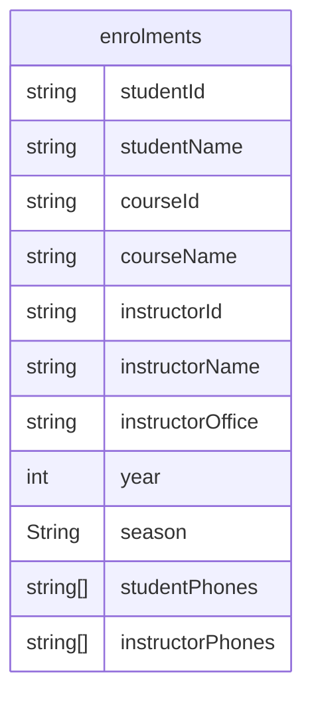
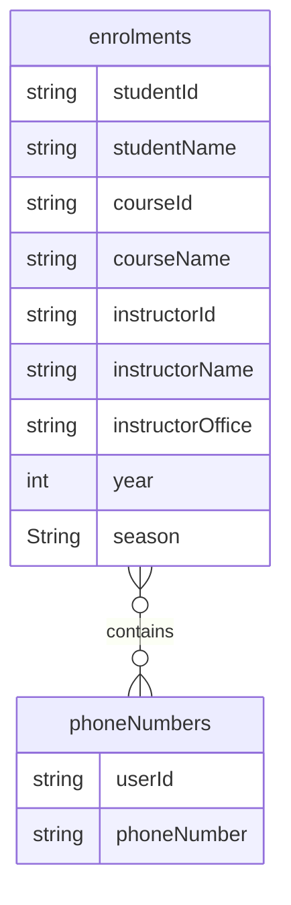
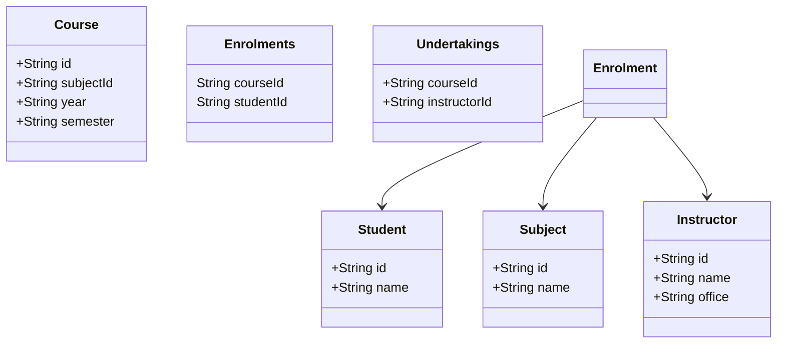
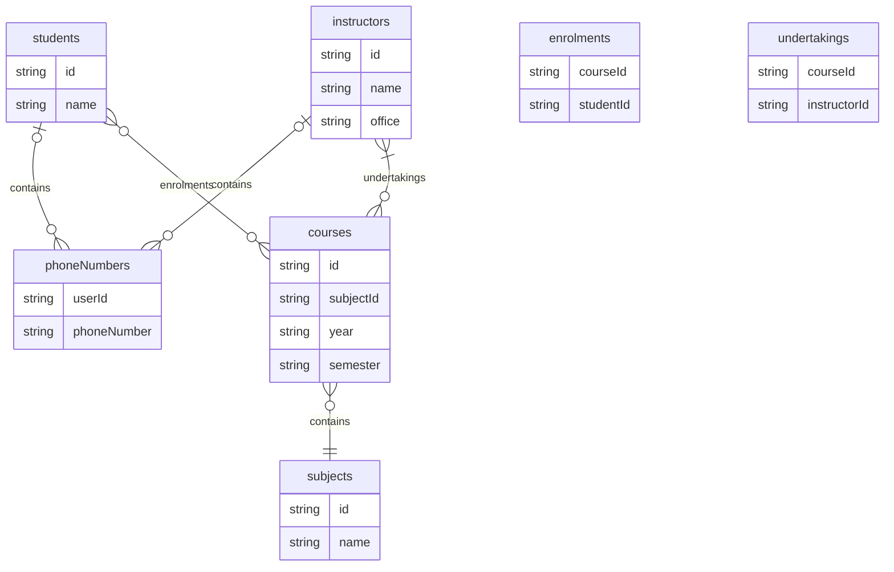

### Normalization

For in-depth analysis, got through the slides here:
https://www.db-book.com/slides-dir/PDF-dir/ch7.pdf

To reduce dependencies between different columns in a table.
To store it in a logical and structured way.

#### Why?
- To reduce the data redundancy
- To improve the data consistency (or integrity) on updates
- Flexibility (changing schema)

Let's take the example of the following table:

Above, an example of transitive dependency is this:
- Student name (A) depends on Student Id (B)
- Student id (B) depends on the year and season (C).
  > Meaning that, one student taking a particular course
  > (ex, OS course in year 2024 Spring) depends on the year and Season.

A -> B -> C : A -> C

We need to split this table.

### 1NF

Flat data -> no arrays or lists

## 2NF

- There are multiple students, teachers, courses.
- One student can enroll in multiple courses in each semester.
- One or more teachers undertake the course on a particular year's semester.

Semester:
2024-Autumn
2024-Spring
Year 2024
Semester Autumn / Spring

### Transitive dependency

A <- B <- C : Transitive property C -> A.

