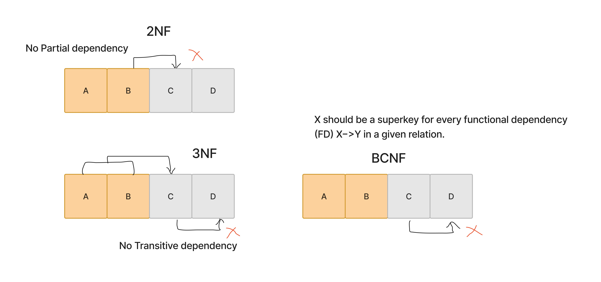
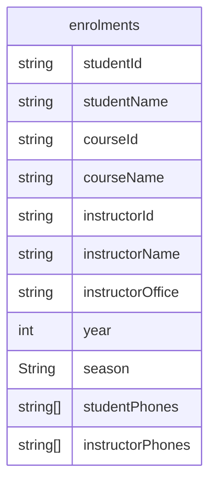
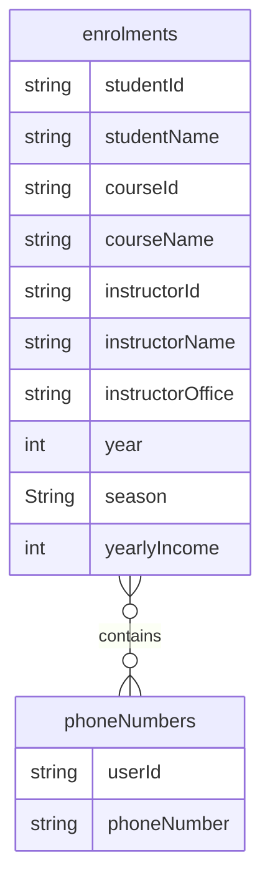
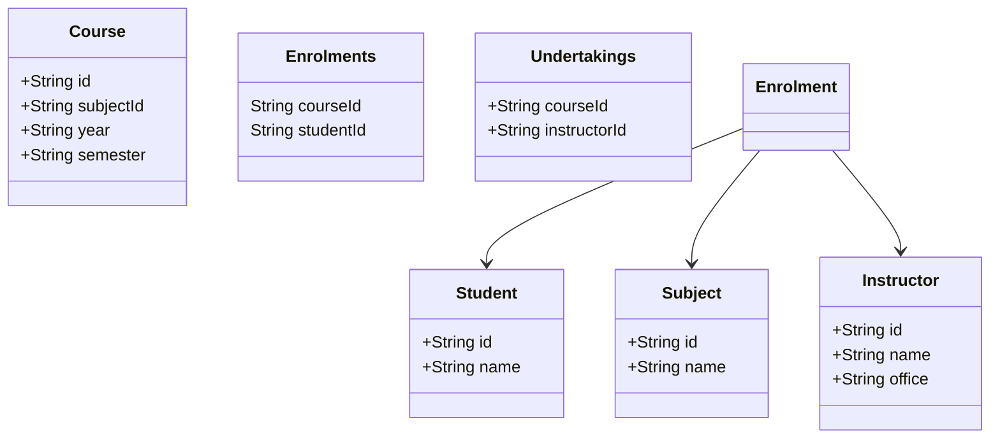
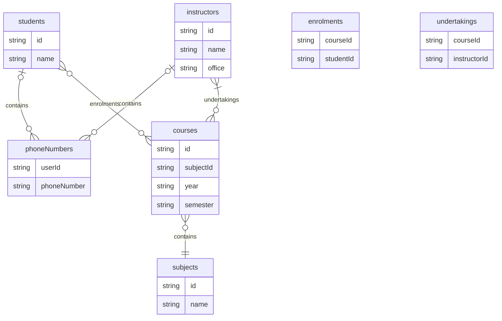

### Normalization

For in-depth analysis, got through the slides here:
https://www.db-book.com/slides-dir/PDF-dir/ch7.pdf

To reduce dependencies between different columns in a table.
To store it in a logical and structured way.

#### Why?
- To reduce the data redundancy
- To improve the data consistency (or integrity) on updates
- Flexibility (changing schema)

#### Normalization Forms

##### 1NF

All relational databases are by default in 1NF.
But, someone could design a table,
with a column as `phone numbers` and have value like
`100,120,233`.
One could then argue that the table is not in 1NF.

##### Some definitions

1. `prime attribute`: A column which is part of a candidate key. 
2. `B functionally dependent on A`: If you know A, you can determine the value of B.
3. `candidate key`: A **minimal** set of attributes which can uniquely determine all other attributes of a table.

Normalization gist:
> All the non-prime attributes (columns of a table) should be fully
> functionally dependent on the primary key only, i.e., all arrows should
> arise from the primary key, but from nowhere else.

##### 2NF

A table should not contain any partial dependencies.
A partial dependency happens when a non-prime attribute
is functionally dependent on a proper subset of a candidate key.

| year | season | College VP | HOD  |
|------|--------|------------|------|
| 2004 | Autumn | Bob        | Mark |
| 2004 | Spring | Bob        | Harry|
| 2005 | Autumn | Alice      | Jack |

For example, college vice president is elected yearly,
while Head of Department (HOD) is elected in every semester.
In below table, the Primary Key is (year, season) tuple.
Now, `year -> College VP`, `(year, season) -> HOD`.
`year -> College VP` is a partial dependency.
We should split the table into:

| year | season | HOD  |
|------|--------|------|
| 2004 | Autumn | Mark |
| 2004 | Spring | Harry|
| 2005 | Autumn | Jack |

| year | HOD  |
|------|------|
| 2004 | Mark |
| 2004 | Harry|
| 2005 | Jack |

##### 3NF

A table should not contain transitive dependencies to the primary key.
`A -> B -> C`, where `A` is the primary key should not happen.

| year | VP | VP_email_address |
|------|-----|------------------|

Here, `year` is the primary key. The `VP` depends on the year,
while `VP email address` depends on the `VP`.
`year -> VP -> VP_email_address`. This should not happen in 3NF.
We must split into:

| year | VP |
|------|-----|

| VP | VP_email_address |
|-----|------------------|

##### BCNF

A table should only have functional dependencies of form `A -> x`,
where `A` is the primary key, and `x` is any other attribute.
For example, there should not be `B -> C` dependency in a table
where `A` is primary key.

Let's take the example of the following table:

Above, an example of transitive dependency is this:
- Student name (A) depends on Student Id (B)
- Student id (B) depends on the year and season (C).
  > Meaning that, one student taking a particular course
  > (ex, OS course in year 2024 Spring) depends on the year and Season.

A -> B -> C : A -> C

We need to split this table.

### 1NF

Flat data -> no arrays or lists

## 2NF

- There are multiple students, teachers, courses.
- One student can enroll in multiple courses in each semester.
- One or more teachers undertake the course on a particular year's semester.

Semester:
2024-Autumn
2024-Spring
Year 2024
Semester Autumn / Spring

### Transitive dependency

A <- B <- C : Transitive property C -> A.

